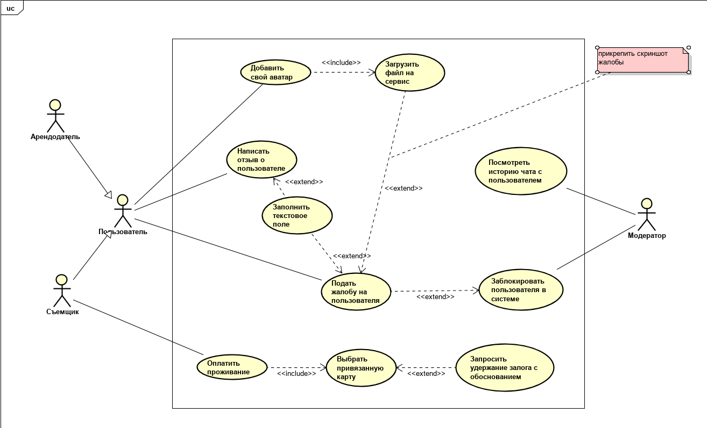

**Задание «Диаграмма вариантов использования»**

**Цель:** подготовить диаграмму системных вариантов использования для приложения по съёму жилья.

**Контекст:**
Представьте, что вы прорабатываете приложение, которое помогает связаться съёмщикам и арендодателям для того, чтобы снять\сдать квартиру c минимальной продолжительностью срока аренды от одних суток. Необходимо обозначить действующие лица (ДЛ), очертить границы приложения, перечислить варианты использования (ВИ) и правильно связать между собой ВИ.

**Задание:**
Итак, вам представлен набор элементов для диаграммы:

арендодатель – тот, кто хочет сдать свою квартиру через сервис. Может добавить некоторую информацию о себе, чтобы понравиться съёмщику.

съемщик – тот, кто приходит в приложение, чтобы выбрать и снять квартиру. Может добавить некоторую информацию о себе, чтобы понравиться арендодателю.
Эти пользователи могут общаться друг с другом внутри сервиса. Если что-то в этом общении не нравится, можно оставить отзыв и дать обратную связь модератору. Это письменнная жалоба, но опционально можно и прикрепить скриншот, например.

модератор – сотрудник сервиса, который следит за тем, чтобы ничего неправомерного не было. Самим приложением не пользуется, другим никак не виден, управляет всем через свой специальный интерфейс модератора. При этом имеет доступ к данным пользователей, создаваемому ими контенту и результату их взаимодействия.

В системе можно вызвать следующие Варианты Использования:

Заблокировать пользователя в сервисе
Выбрать привязанную карту
Добавить свой аватар
Подать жалобу на пользователя
Посмотреть историю чата с пользователем
Заполнить текстовое поле
Написать отзыв о пользователе
Запросить удержание залога с обоснованием
Оплатить проживание
Загрузить файл на сервис

Необходимо добавить ещё 1 элемент: одно действующее лицо, которое бы очень упростило читаемость схемы (это намёк на связь “обобщение” :) )

**Условия:**
– на диаграмме присутствуют все необходимые элементы, очерчены границы приложения
– Варианты Использования корректно связаны между собой (где необходимо)
– Введено новое действующее лицо, корректно связанное с перечисленными в задании ДЛ

**Решение**

