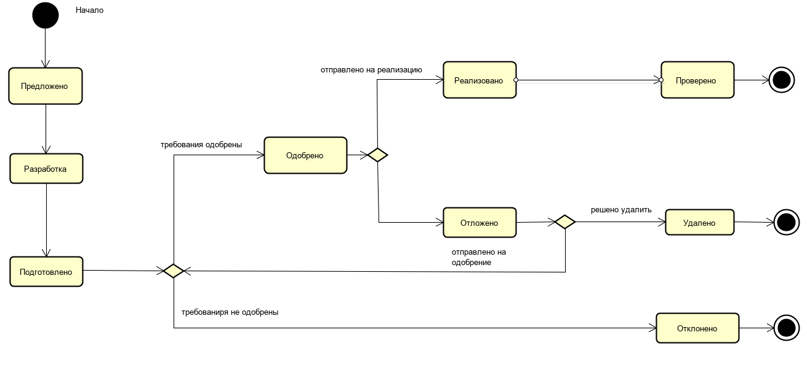

**Задание Согласование и управление изменениями требований**

Перед вами домашнее задание по теме “Согласование и управление изменениями требований”.

**Цель:** заполнить порядок согласования требования или изменения требования

**Контекст:**
Представьте, что вы стали участником новой команды. Перед вами поставили задачу - нарисовать процесс, с целью презентации его команде и дальнейшего использования его в работе.

**Задание:**
Составить описание бизнес-процесса (можно использовать любую известную подходящую нотацию: диаграмма активити или диаграмма состояний UML, блок-схема, BPMN).
Путь согласования требования: от момента его инициации до завершения работы с требованием.
Бизнес-процесс должен описать процесс перехода из одного состояния требования в другое (слайд #30). Подробное описание не нужно.

**Список всех состояний, который нужно использовать в процессе:**
Предложено
Разработка
Подготовлено
Одобрено
Реализовано
Проверено
Отложено
Удалено
Отклонено

**Решение**

