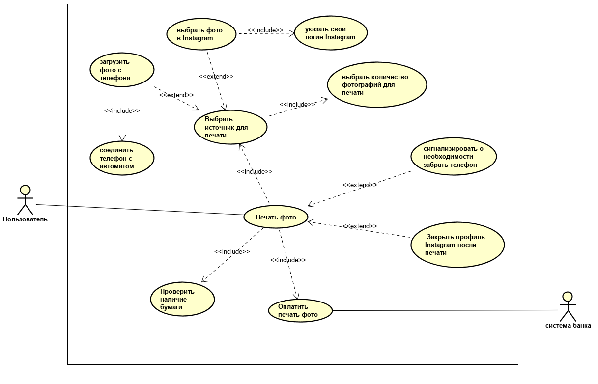

**Итоговая работа по модулю "Анализ требований"**

**Контекст**
Вы — аналитик команды, которая разрабатывает программное обеспечение для автомата, печатающего фото из Instagram.
На встрече с представителем заказчика выяснили, что автомат должен работать следующим образом:

1. При нажатии на кнопку «Выбрать фото для печати» на главном экране пользователю предложены 2 способа — выбрать фото в Instagram или загрузить фото с телефона.
1. Для выбора фото из Instagram пользователю необходимо указать свой логин. Профиль пользователя должен быть открытым.
1. Для выбора фото с телефона, пользователю нужно соединить телефон с автоматом для печати фото через кабель для зарядки.
1. Пользователь может выбрать количество фотографий для печати через экран автомата. Минимальное количество фото — 1, максимальное —100 (если в автомате достаточно бумаги).
1. Оплатить печать фото можно только по карте через физический терминал бесконтактной оплаты.
1. Печать фото запускается после успешной оплаты выбранного пакета фотографий.
1. Если пользователь вводил логин Instagram для печати фотографий, то после завершения печати его страница в автомате должна быть закрыта.
1. Если пользователь присоединял телефон для печати фотографий, то после завершения печати автомат будет сигнализировать о необходимости забрать телефон.

**Задание**

1. Напишите минимум 5 формализованных требований к разрабатываемому программному обеспечению (желательно разных типов, но на ваше усмотрение).
1. Подготовьте диаграмму вариантов использования, покрывающую описанные в контексте действия.
1. Подготовьте текстовое описание любого варианта использования из получившейся на шаге 2 диаграммы.
1. *(не обязательно) подумайте и опишите словами, обработку каких системных ошибок нужно учесть при реализации программного обеспечения.*

**Критерии оценивания итоговой работы**
По итогу выполнения итоговой работы вы получите - зачёт/незачёт.

**Зачёт:**
Задание считается выполненным, если:

- описано не менее 5 требований к программному обеспечению
- требования сформулированы лаконично, в официально-деловом стиле изложения
- требования не противоречат друг другу
- требования обладают всеми свойствами хороших требований: полнота, ясность, корректность, согласованность, верифицируемость, осуществимость
- в диаграмме присутствует действующее лицо
- верно определены связи между кейсами
- кейс описан логично, структурные ошибки отсутствуют
#
#

# **Формализованные требований кразрабатываемому программному обеспечению**

ПТ001. <ПТ – пользовательское требование, 001 – порядковый номер>

ФТ001. <ФТ – функциональное требование, 001 – порядковый номер>

НФТ001. <НФТ – нефункциональное требование, 001 – порядковый номер>

ОГР001. <ОГР – ограничение, 001 – порядковый номер>

ПТ001. Пользователь должен иметь возможность выбрать источник загрузки фото.

ПТ002. Пользователь должен иметь возможность присоединить телефон к автомату через кабель зарядки .

ПТ003. Пользователь должен иметь возможность ввести логин от своего профиля instagram.

ПТ004. Пользователь должен иметь возможность выбрать необходимое количество фото для печати.

ПТ005. Пользователь должен иметь возможность оплатить печать своих фото.

ФТ001. Система должна иметь возможность произвести печать фото с профиля instagram.

ФТ002. Система должна иметь возможность произвести печать фото с телефона подключенному через кабель зарядки.

ФТ003. Система должна проверять количество бумаги перед печатью фото.

ФТ004. Система должна дать возможность оплатить печать выбранных фото.

НФТ001. Система должна сигнализировать о необходимости забрать телефон.

НФТ002. Система должна закрывать профиль instagram после печати фото

ОГР001. Система должна иметь возможность производить оплату только по карте через физический терминал бесконтактной оплаты.

ОГР002. Система должна иметь возможность печати фото в количестве от 1 до 100 штук.
#
**2. Диаграмма вариантов использования, покрывающая описанные в контексте действия.**

**3. Текстовое описание варианта использования**

**DС-PC-1** Печать фотографий в автомате

**Краткое описание:** Потенциальный клиент (пользователь) печатает фото на автомате, выбрав фотографии со своего смартфона, либо c профиля instagram.

**Действующие лица:** пользователь.

**Триггер**: пользователь активирует экран автомата.

**Предусловия:** Пользователь выбрал фото для печати в автомате.

Сначала пользователь выбирает фото для печати, затем оплачивает услугу и автомат печатает фото, после этого автомат закрывает профиль instagram, либо сигнализирует об отсоединении смартфона.

**Основной поток:**

1. Пользователь активирует экран автомата.
1. Система предлагает пользователю выбрать источник для печати фото на главном экране.
1. Если пользователь выбирает загрузку фото с профиля instagram, то управление переходит на следующий шаг
1. ` `Пользователь указывает свой логин instagram
1. Система ищет профиль
1. Если профиль пользователя найден, то управление переходит на следующий шаг.
1. Система проверяет открытость профиля
1. Если профиль пользователя открыт, то управление переходит на следующий шаг.
1. Система загружает фото
1. ` `Система предлагает выбрать фото для печати
1. ` `Пользователь выбирает количество фото от 1 до 100 шт.
1. Если в автомате достаточно бумаги, то управление переходит на следующий шаг
1. Пользователь оплачивает печать фото по карте через физический терминал бесконтактной оплаты
1. ` `Если оплата прошла успешно, то управление переходит на следующий шаг
1. ` `Система запускает печать фото
1. ` `Система закрывает профиль Instagram после печати
1. ` `Вариант использования завершает свою работу

**Альтернативный поток:**

1а Если пользователь выбирает загрузить фото с телефона, то управление переходит на следующий шаг

1. Пользователь соединяет телефон с автоматом через кабель для зарядки
1. Система предлагает выбрать фото для печати
1. Если в автомате достаточно бумаги, то управление переходит на следующий шаг
1. Пользователь оплачивает печать фото по карте через физический терминал бесконтактной оплаты
1. Если оплата прошла успешно, то управление переходит на следующий шаг
1. ` `Система запускает печать фото
1. Система сигнализировать о необходимости забрать телефон
1. `  `Вариант использования завершает свою работу

8а. Профиль пользователя закрыт

1\.                Система отображает уведомление о недоступности профиля пользователя.

2\.                Система предлагает пользователю сделать профиль открытым

3\.                Управление переходит на шаг 2

8а. Профиль пользователя закрыт

1\.                Система отображает уведомление о недоступности профиля пользователя.

2\.                Система предлагает пользователю распечатать фото используя кабель зарядки телефона

3\.                Управление переходит на шаг 14

10а. Пользователь не выбирает ни одного фото.

1\.                Система отображает уведомление о необходимости выбрать хотя бы одно фото

2\.                Управление переходит на шаг 6

10б. Пользователь выбирает больше 100 фотографий.

1\.                Система отображает уведомление о необходимости выбрать фото в количестве меньше 100 шт.

2\.                Управление переходит на шаг 6

12а. В автомате недостаточное количество бумаги для печати фото.

1\.                Система отображает уведомление о необходимости уменьшить количество фото на равное количеству бумаги оставшейся в автомате.

2\.                Управление переходит на шаг 6

14а. Оплата не завершилась успехом, поскольку недостаточно средств у пользователя

1\.                Система отображает уведомление о том что у пользователя недостаточно средств и предлагает выбрать меньшее количество фото.

2\.                Управление переходит на шаг 6

14б. Оплата не завершилась успехом, поскольку недоступна система банка.

1\.                Система отображает уведомление о недоступности системы банка.

2\.                Система предлагает произвести оплату повторно

3\.                Управление переходит на шаг 9

15а. Кабель для зарядки неисправен

1\.                Система предлагает пользователю выбрать загрузку фото с профиля instagram

2\.                Управление переходит на шаг 3

**Поток исключения:**

12б. В автомате отсутствует бумага для печати фото.

1\.                Система меняет статус автомата на  «Не работает»

2\.                Вариант использования завершает свою работу

14в. Оплата не завершилась успехом, поскольку недоступен терминал бесконтактной оплаты.

1\.                Система меняет статус автомата на  «Не работает»

2\.                Вариант использования завершает свою работу

**Постусловие:** В случае успешного выполнения основного потока, пользователь получает распечатанные фото.

**Результат:** Если ВИ выполнен успешно, можно считать, фото получено пользователем.

