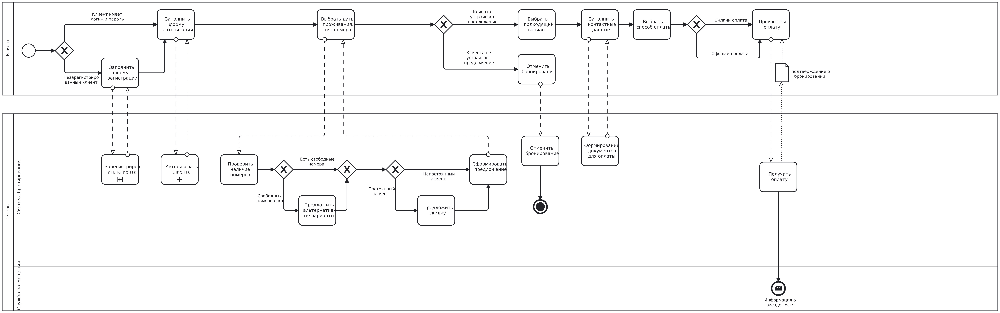

**Задание**

Занятие 3. Моделирование БП BPMN 2.0

В прошлом задании вы научились строить простые схемы в нотации BPMN 2.0. Теперь у вас более сложная задача. Умение моделировать бизнес-процессы — очень важный навык аналитика.

**Контекст**

Вам поставили задачу — автоматизировать системы бронирования в отеле. Заказчик предъявляет следующие требования.

Клиент:

1. Должен иметь возможность авторизоваться и зарегистрироваться в системе по номеру телефона.
1. Должен иметь возможность выбрать даты проживания и тип номера.
1. Должен заполнить контактные данные.
1. Может выбрать удобную форму оплаты — онлайн или офлайн.
1. Может отменить бронирование до оплаты номера.
1. Должен получить информацию о бронировании на электронную почту.

Система:

1. Должна предоставлять информацию о доступных номерах на выбранную дату.
1. Должна предложить альтернативу, если подходящих вариантов размещения нет.
1. Для постоянных клиентов должна предлагать скидку.
1. Должна получать оплату и формировать подтверждение бронирования.
1. Должна направлять в службу размещения информацию о заезде гостя.

**Задание**

1. Нужно полностью нарисовать существующий процесс. На диаграмме отразите путь клиента и его взаимодействие с системой.
1. На основании нарисованного процесса сформулируйте не менее трёх предложений по его оптимизации с точки зрения бизнеса. Нововведение может принести дополнительную выручку или сократить расходы.

**Рекомендованные инструменты:**
draw.io, stormbpmn.com, bpmn.io, camunda.com

**Формат сдачи работы:**

Загрузите готовую схему в личный кабинет в виде файла в формате jpeg, png или pdf. Предложения по оптимизации пропишите текстом в поле «Решение».

**Критерии оценивания:**

Задание считается **выполненным**, если:

- описан весь требуемый функционал;
- действия названы правильно;
- процесс проходит через все используемые роли;
- отображены дорожки для всех ролей;
- использованы верные шлюзы;
- сформулированы предложения по оптимизации процесса.

**Решение**

Решение:

1. Клиент после выбора офлайн или онлайн оплаты может отменить оплату, если он передумал.
1. Подпроцессы авторизации и регистрации можно более подробно расписать
1. Альтернативные номера можно искать после выбора даты проживания, типа номера и ввода контактных данных.
1. Рассчитать скидку можно после выбора того или иного типа номера.
1. После расчета скидки система должна рассчитать стоимость и отобразить клиенту форму оплаты с выбором типа оплаты (онлайн/оффлайн)

