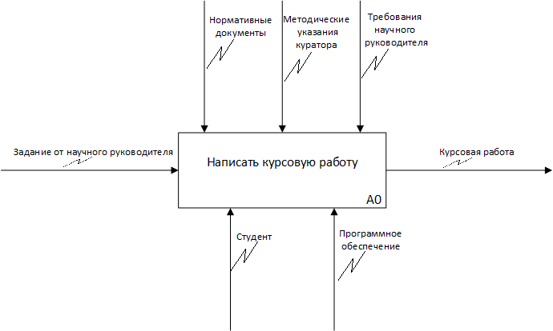
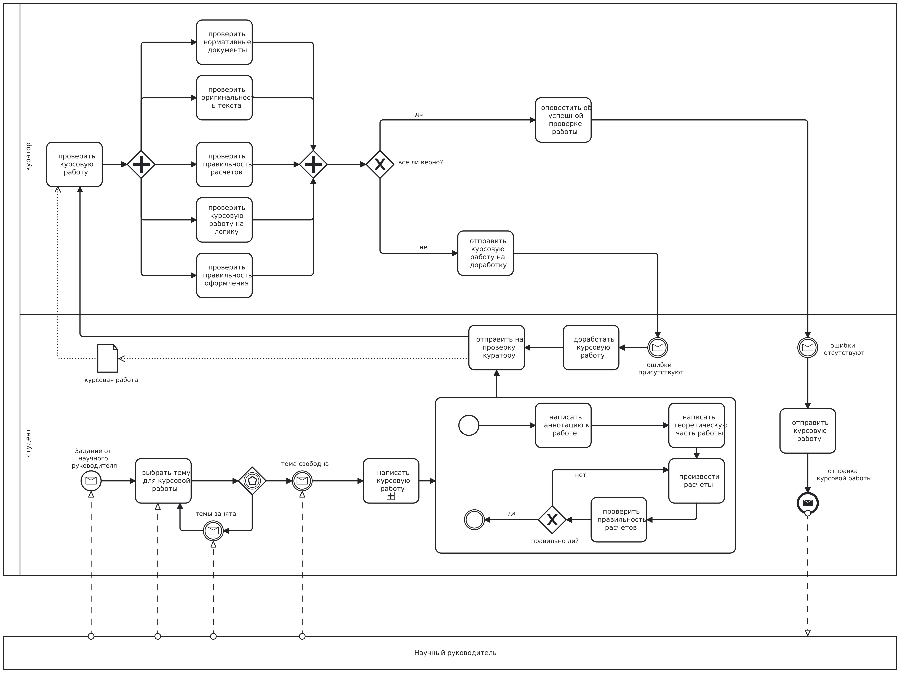

Модульная итоговая работа по разделу «Моделирование бизнес-процессов» (MBP)

Выполните итоговое задание по модулю, чтобы закрепить знания и навыки по моделированию бизнес-процессов.

**Задание**
1\. Подробно нарисуйте один из предложенных процессов на выбор:

- оформление путёвки в туристическом агентстве,
- заказ пошива одежды в ателье,
- написание курсовой работы в университете.
  - Верхнеуровневый процесс нарисуйте в нотации IDEF0.
  - Детализацию процесса оформите в BPMN 2.0 в виде диаграммы взаимодействия.
  - На схеме должны присутствовать:
- **минимум один детализированный подпроцесс**,
- не менее трёх видов промежуточных событий,
- не менее двух дорожек в пуле основного процесса,
- не менее 10 действий.

**Рекомендованные инструменты:**
draw.io, stormbpmn.com, bpmn.io, camunda.com

**Решение**

