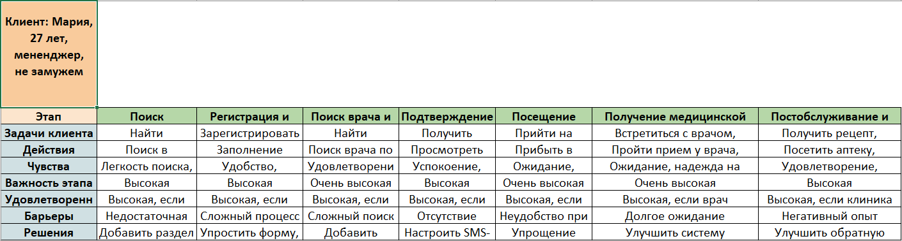

**Итоговая работа по модулю "Документирование в IT-проектах"**

**Задание**

Предлагаем вам выполнить итоговое задание по модулю с целью закрепления полученных знаний и навыков по документированию в IT-проектах.

**Контекст**
Вам необходимо подготовить документацию для проекта по реализации приложения «Запись на прием» для медицинской клиники.

**Задание**

1. Создайте CJM от лица клиента медицинской клиники
1. На основании CJM подготовьте ТЗ или SRS (на выбор);
1. Создайте план-график работ, включающий запуск MVP и последующие доработки

**Критерии оценивания итоговой работы**
По итогу выполнения итоговой работы вы получите - зачёт/незачёт.

**Зачет**:

- СJM содержит не менее 7 этапов использования продукта. По каждому этапу указаны задачи пользователя, действия пользователя, чувства, важность этапа, удовлетворенность клиента, барьеры и решения
- в ТЗ или SRS прописаны все разделы (подразделы можно использовать только значимые с точки зрения функционала)
- требования должны быть корректными по отношению к выбранному продукту
- требования сформулированы лаконично, в официально-деловом стиле изложения
- план-график содержит все необходимые этапы, а также перечень задач в бэклоге

**CJM от лица клиента медицинской клиники**

**Software Requirements Specification (SRS) в соответствии со стандартом IEEE 830-1998 для приложения «Запись на прием»**
**

**1. Введение**

**1.1 Назначение**

Цель данного документа - определить требования к приложению “Запись на прием” для медицинской клиники.

**1.2 Область действия**

Приложение “Запись на прием” предназначено для упрощения процесса записи пациентов на прием к врачам.

**1.3 Определения, акронимы и сокращения**

- **MVP**: Минимально жизнеспособный продукт (Minimum Viable Product).
- **API**: Интерфейс программирования приложения (Application Programming Interface).
- **SRS**: Software Requirements Specification
- **IEEE**: Institute of Electrical and Electronics Engineers

**1.4 Ссылки**

- Сайт медицинской клиники

**1.5 Краткий обзор**

Приложение “Запись на приём” позволяет пользователям искать врачей, просматривать их профили и записываться на прием.

**2. Общее описание**

**2.1 Взаимодействие продукта**

- Приложение взаимодействует с базой данных врачей и расписанием.
- Врачи регистрируются и вносят свои данные.

**2.2 Функции продукта**

- **Поиск врачей**:
  - Пользователи могут искать врачей по специализации и местоположению.
- **Отображение профилей врачей**:
  - Пользователи могут просматривать профили врачей с учетом рейтинга и отзывов.
- **Запись на прием**:
  - Пользователи могут записываться на прием к выбранному врачу.

**2.3 Характеристики пользователя**

- **Пациенты**:
  - Ищут врачей и записываются на прием.

**2.4 Ограничения**

- **Временные рамки**:
  - Разработка MVP должна быть завершена в течение 6 месяцев.
- **Бюджет**:
  - Ограниченные ресурсы на разработку.

**2.5 Допущения и зависимости**

- Врачи активно используют приложение.

**3. Детальные требования**

**3.1 Требования к внешним интерфейсам**

**3.1.1 Интерфейсы пользователя**

- **Регистрация и авторизация врачей**:
  - Врачи должны иметь возможность зарегистрироваться и войти в систему.
- **Поиск врачей и просмотр профилей**:
  - Пользователи должны иметь доступ к функциональности поиска врачей и просмотра их профилей.
- **Запись на прием**:
  - Пользователи должны иметь возможность записаться на прием к выбранному врачу.

**3.1.2 Интерфейсы аппаратного обеспечения**

- Взаимодействие с мобильными устройствами.

**3.1.3 Интерфейсы программного обеспечения**

- Взаимодействие с базой данных врачей и расписанием.

**3.1.4 Интерфейсы взаимодействия**

- Взаимодействие с API для отображения доступных приемов.

**3.2 Функциональные требования**

- **Поиск врачей**:
  - Пользователи могут искать врачей по специализации и местоположению.
  - Поиск должен быть быстрым и точным.
- **Отображение профилей врачей**:
  - Пользователи могут просматривать профили врачей с учетом рейтинга, отзывов и расписания.
  - Профили должны содержать информацию о специализации, опыте, образовании и контактных данных врача.
- **Запись на прием**:
  - Пользователи могут записываться на прием к выбранному врачу.
  - Запись должна быть интуитивно понятной и удобной.

**3.3 Требования к производительности**

- **Быстрый поиск врачей**:
  - Время отклика при поиске не должно превышать 1 секунду.
- **Отзывы о врачах**:
  - Отображение отзывов о врачах должно быть мгновенным.

**3.4 Проектные ограничения**

- **Соответствие стандартам безопасности и защиты данных**:
  - Приложение должно соответствовать стандартам безопасности и обеспечивать защиту персональных данных пациентов и врачей.

**3.5 Нефункциональные требования**

- **Надежность**:
  - Приложение должно быть доступно 24/7.
- **Доступность**:
  - Поддержка разных языков (английский, русский).
  - Доступность для пользователей с ограниченными возможностями.
- **Безопасность**:
  - Защита данных пациентов и врачей.
  - Аутентификация и авторизация.
  - Шифрование данных.

**3.6 Другие требования**

- **Интеграция с существующими системами клиники**:
  - При необходимости интегрировать приложение с системами учета, расписания и другими.

**4. Приложения**

- Не применимо

**5. Алфавитный указатель**

- Не применимо

**План-график работ, включающий запуск MVP и последующие доработки**

1. **Подготовительные этапы** (1 месяц):
   1. Определение требований (2 недели).
   1. Анализ рынка и конкурентов (2 недели).
1. **Разработка MVP** (3 месяца):
   1. Проектирование архитектуры (2 недели).
   1. Разработка функциональности (6 недель):
      1. Регистрация и авторизация (2 недели).
      1. Поиск врачей и просмотр профилей (2 недели).
      1. Запись на прием (2 недели).
   1. Тестирование MVP (2 недели).
1. **Запуск MVP** (1 месяц):
   1. Релиз приложения (2 недели).
   1. Маркетинг и продвижение (2 недели).
1. **Последующие доработки** (6 месяцев):
   1. Улучшение функциональности (3 месяца):
      1. Добавление отмены записи на прием (1 месяц).
      1. Расширение профилей врачей (2 месяца).
   1. Оптимизация производительности (1 месяц).
   1. Обновление безопасности (1 месяц).
1. **Бэклог задач**:
   1. Создание списка задач для доработок (постоянно обновляется).

